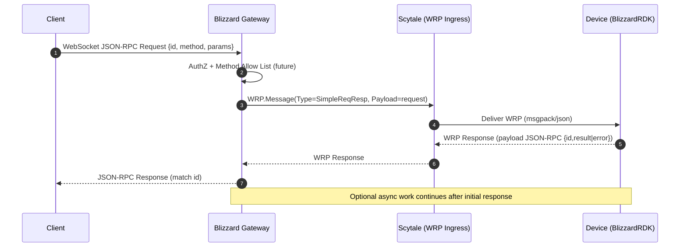
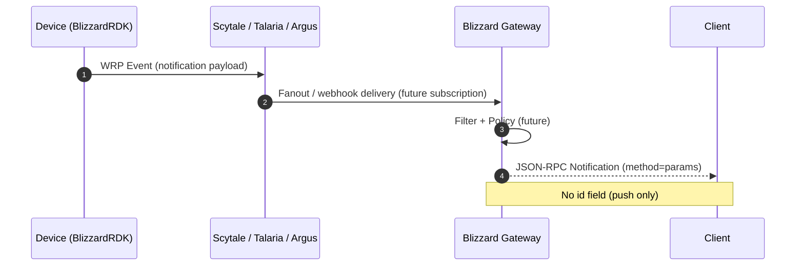

# Blizzard Gateway Specification (Draft)

## Purpose

Expose a stable JSON-RPC 2.0 WebSocket surface for external/control-plane clients while bridging into the XMiDT/WRP fabric to reach BlizzardRDK device runtimes.

## Responsibilities

* Accept client WebSocket connections (one logical session per client consumer)
* Authenticate (future: bearer/OIDC or mTLS)
* Authorize per-method (allow list / policy integration)
* Translate client JSON-RPC requests to WRP messages (implemented: SimpleRequestResponse)
* Correlate responses / asynchronous notifications
* Fan out device-originated events as JSON-RPC notifications
* Provide structured metrics and structured logging

## Non-Goals (Initial Phase)

* Multi-tenant quota enforcement (later)
* Persistent storage (stateless by design)
* Batch JSON-RPC requests (may be added)

## High-Level Flow (Future State)

```text
Client --JSON-RPC--> Gateway --WRP--> Scytale --> Device (BlizzardRDK)
Client <--JSON-RPC-- Gateway <--WRP-- Scytale <-- Device Notifications
```

### Sequence: Request / Response Path



### Sequence: Device-Originated Notification



## WebSocket Endpoint

```json
GET /ws?deviceId=<mac>&service=<svc>
Upgrade: websocket
```

Alternatives:

* Path parameters `/ws/<deviceId>/<service>` (current scaffold uses generic `/ws` and expects parsing later)

## JSON-RPC <-> WRP Mapping (Implemented Phase 1)

| JSON-RPC Field | WRP Field (future)            | Notes |
|----------------|-------------------------------|-------|
| id             | TransactionUUID               | 1:1 mapping (UUID v4 or client supplied string) |
| method         | (in payload)                  | Embedded verb; WRP content-type stays `application/json` |
| params         | Payload                       | Raw JSON marshaled |
| result/error   | Payload in response           | Device runtime includes full JSON-RPC response |

For request-response the gateway wraps the JSON-RPC request body into a `wrp.Message` using `SimpleRequestResponseMessageType`:

```go
wrp.Message{
  Type: SimpleRequestResponseMessageType,
  Source:   "blizzardgw",
  Destination: fmt.Sprintf("mac:%s/%s", deviceID, service),
  ContentType: "application/json",
  Payload: <raw jsonrpc request bytes>
}
```
Responses reverse the process. The device (or downstream runtime) SHOULD return a WRP message whose `Payload` is a JSON-RPC response object. If the payload is not valid JSON-RPC, the gateway will treat the raw bytes as a success `result` blob.

### Transport Contract

HTTP POST (msgpack-encoded WRP):

```http
POST {SCYTALE_URL}
Content-Type: application/msgpack
Authorization: (optional pass-through)

<msgpack wrp.Message>
```

Expected 2xx with msgpack-encoded `wrp.Message` response. Non-2xx yields JSON-RPC error `code: -32100` with `data` describing upstream status/body excerpt.

Error Mapping:

| Condition | JSON-RPC Error Code | Message |
|-----------|---------------------|---------|
| HTTP non-2xx | -32100 | transport error |
| Encode failure | -32603 | marshal request failed |
| Decode failure (response) | -32101 | decode error (planned) |

Currently decode failure is folded into generic fallback; a dedicated code (-32101) will be added when stricter parsing is introduced.

## Notifications

Device initiated messages enter via upstream WRP events (Argus or Talaria subscription). Gateway converts them into JSON-RPC notifications (no `id`).

## Error Semantics

JSON-RPC errors originating from device runtime propagate unchanged (the gateway simply relays the JSON-RPC response payload). Transport / gateway injected errors occupy the reserved range `-32100` .. `-32199` (see contract doc). Presently used: `-32100` for upstream transport failures.

## Authentication (Planned)

1. Accept Bearer token over WebSocket upgrade
2. Validate remotely (JWKS or introspection)
3. Attach claims context for method policy evaluation

Fallback development mode: no auth (current scaffold).

## Authorization Model (Draft)

Rules: `(principal claims) + method + deviceId + service -> allow | deny`.
Could leverage xconfadmin policy domains for dynamic rules (future).

## Metrics (Planned)

| Metric | Type | Labels |
|--------|------|--------|
| gateway_connections | gauge | state |
| jsonrpc_requests_total | counter | method, success |
| jsonrpc_latency_seconds | histogram | method |
| notifications_total | counter | method |
| reconnect_attempts_total | counter | outcome |

## Logging Fields

* `request_id` (UUID) – JSON-RPC id
* `device_id`
* `service`
* `method`
* `latency_ms`
* `error_code` / `error_message`

## Configuration (Initial)

```json
{
  "listen": ":8080",
  "read_timeout": "15s",
  "write_timeout": "15s",
  "idle_timeout": "60s",
  "scytale_url": "https://scytale.local/api/v2/device/send",
  "scytale_auth": "Basic ..."
}
```

## Reconnect Strategy (Future)

Stateless server: clients reconnect; device path continuity handled by underlying WRP fabric.

## Open Items

* Backpressure + per-connection send queue metrics
* Multi-device multiplexing on a single WebSocket (today: one device/service per connection)
* Method schema validation (JSON Schema bundle)
* Rate limiting tokens (leaky bucket per device/client)

---
This is a living document; update alongside implementation milestones.
